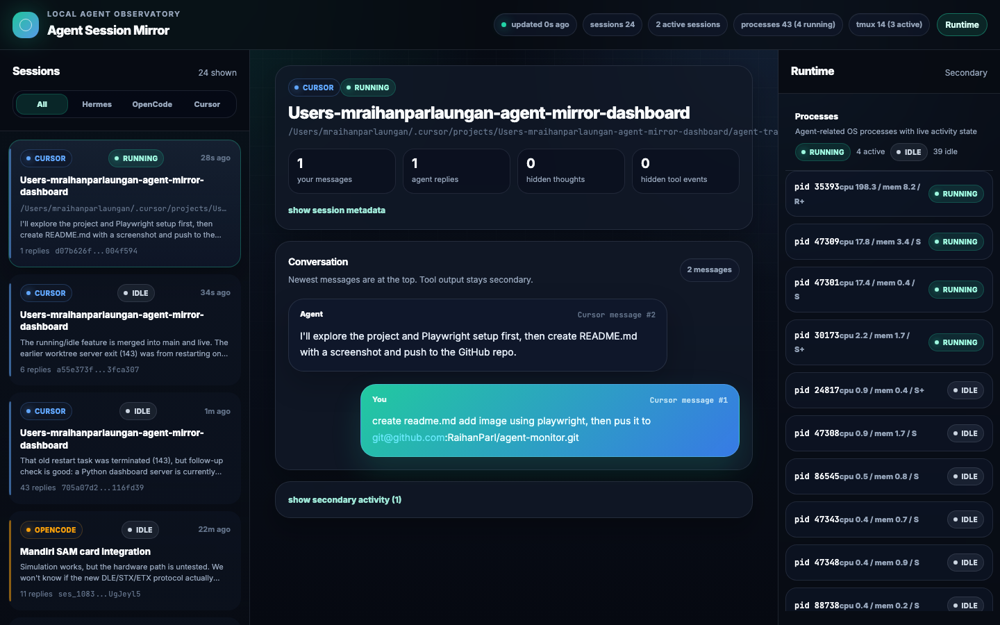

# Agent Mirror Dashboard

Mirrors local Hermes, OpenCode, and Cursor activity into one web UI so you can watch agent progress from another device or browser while keeping Telegram minimal.



## Features

- Shows running agent-related processes with running/idle activity state
- Shows tmux sessions with active/idle state
- Reads Hermes session and message data from `~/.hermes/state.db`
- Reads OpenCode session, message, and part data from `~/.local/share/opencode/opencode.db`
- Reads Cursor agent transcripts and terminal snapshots from `~/.cursor/projects`
- Polls every 2.5 seconds for near-live updates

## Quick start

```bash
cd agent-mirror-dashboard
python3 app.py
```

Open [http://127.0.0.1:8787](http://127.0.0.1:8787)

## Expose on your LAN

The server binds to `0.0.0.0` by default.

```bash
ipconfig getifaddr en0
```

Then open `http://YOUR_MAC_IP:8787` from your phone or another machine on the same network.

## API endpoints

| Endpoint | Description |
|----------|-------------|
| `/` | Web UI |
| `/healthz` | Health check |
| `/api/state` | Full state as JSON |
| `/api/hermes` | Hermes data only |
| `/api/opencode` | OpenCode data only |
| `/api/cursor` | Cursor data only |

## Notes

- Read-only: this dashboard does not send commands to agents.
- It reads whatever those tools persist locally, including reasoning and tool traces when available.
- Cursor visibility depends on what Cursor wrote into transcript JSONL and terminal snapshot files.

## Regenerate the README screenshot

```bash
python3 app.py
npm install
node capture_readme_screenshot.mjs
```
